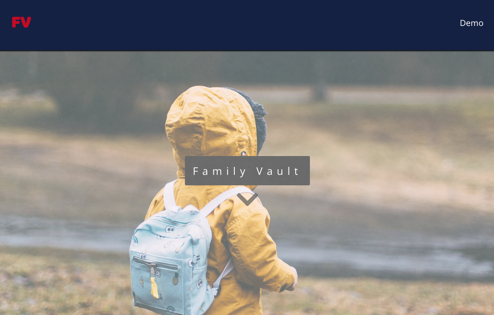
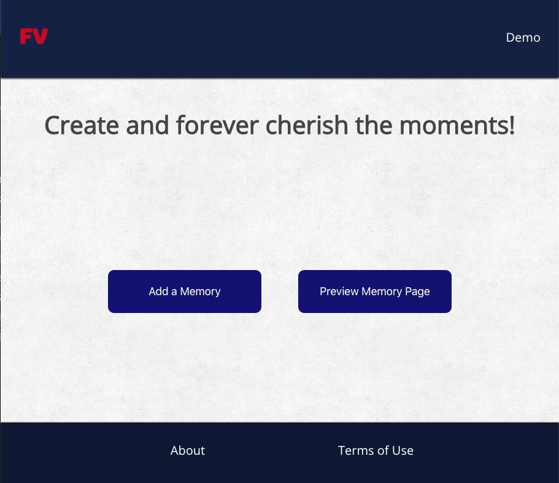
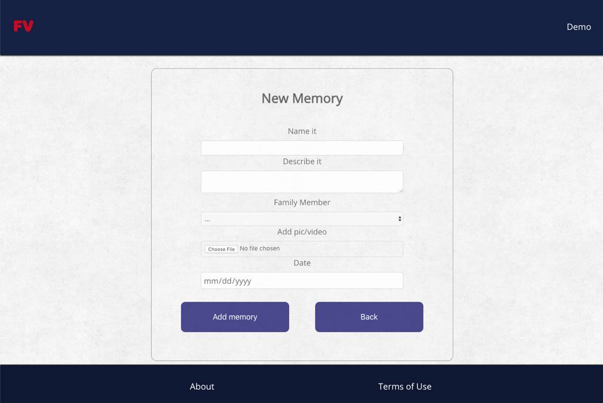
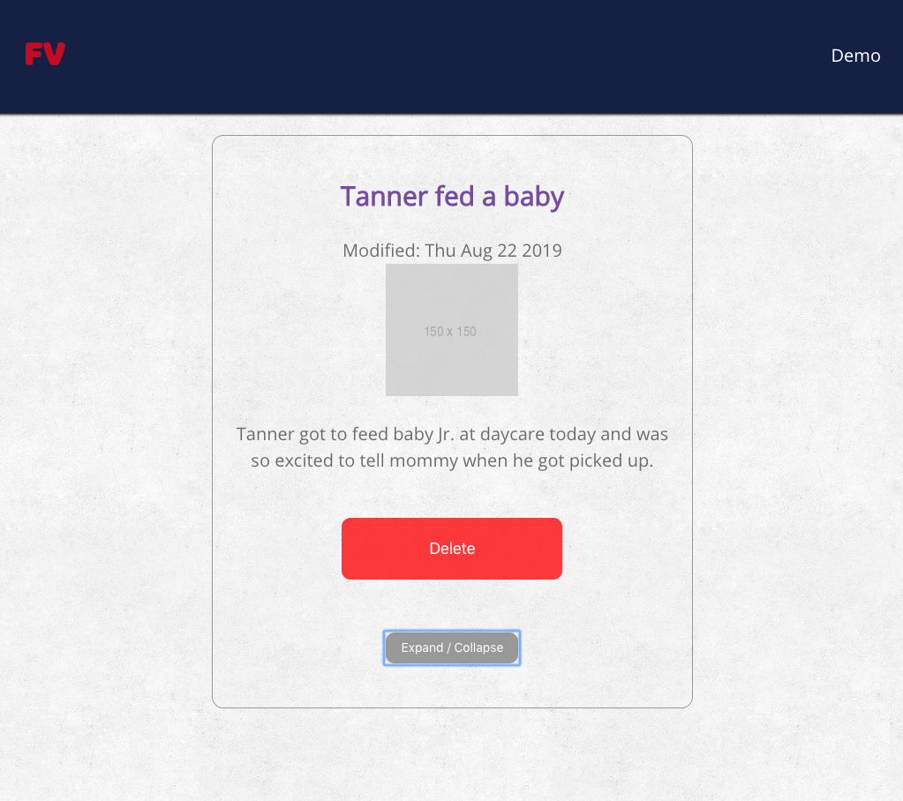
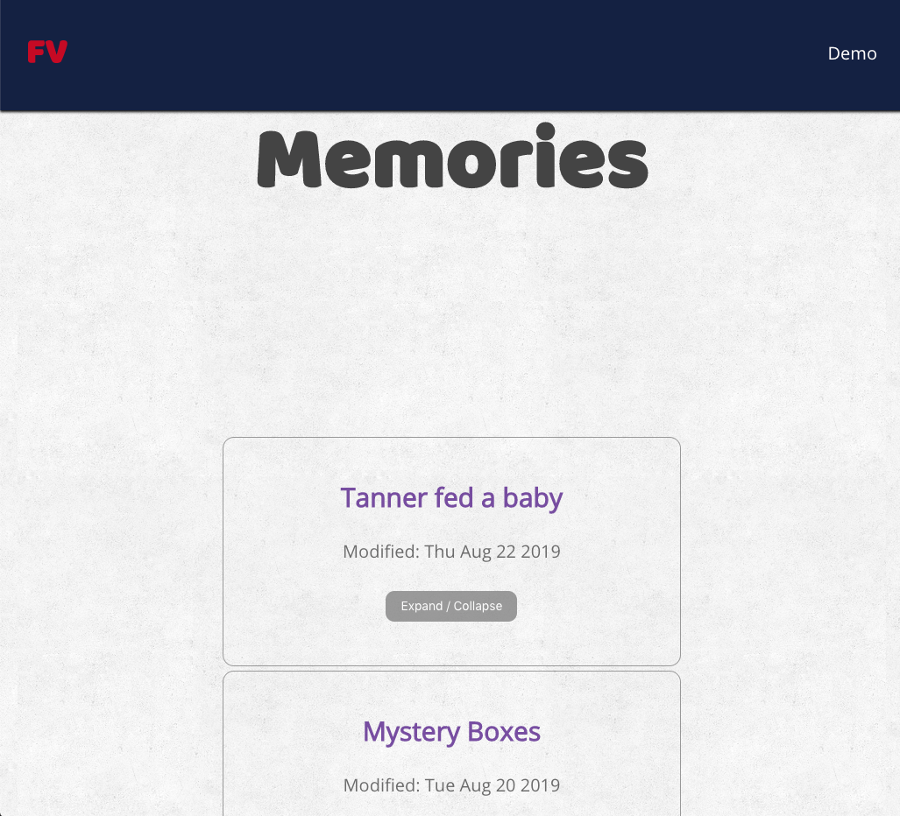

# Family Vault

My wife and I love our children. So many things they do are very precious and dear to our hearts.  We often find ourselves saying, “we have to write this down.” We wanted a way to easily capture these moments where a picture or image would not be able to tell the full story.

## So

When you fail to capture the picture or video and cannot recreate the moment...Vault it!

This app helps capture memories by “Naming it,” “Describing it,” and “Capturing it”! Forever capture your family's precious moments through thoughts, letters, audio, images, and videos.

## See it live! 

* [Live](https://family-vault.petertardif.now.sh/)
* [API Repo](https://github.com/petertardif/family-vault-api)

## Process
1. [User Stories, User Flows, Wireframes](https://docs.google.com/spreadsheets/d/1jFYYlrqykvHg_c2WdfyFHgDGYFy5_mFHzdWDL70umXk/edit#gid=0)
2. [Trello Board](https://trello.com/b/6haebPyh/family-vault)
3. [Feedback Form](https://forms.gle/MH7nSswBtdtVNDsg8)
4. [Presentation Slide Deck](https://docs.google.com/presentation/d/1raNObaBoo4JI54qna1jIhd0JXTsZXaJ-8_G5vSYjVwA/edit?usp=sharing)
5. [App Presentation](https://youtu.be/AkDsCauXJgs)

## API Endpoints
Base URL - https://agile-fortress-94521.herokuapp.com/

#### api/memories
Data retrieval and functionality for all memories related to an individual user.

#### api/memories/:memory_id
Data retrieval and functionality for a single memory related to an individual user.

#### api/family-members
Data retrieval and functionality for all family members associated with an individual user.

#### api/family-members/:familymember_id
Data retrieval and functionality for a single family member related to an individual user.

## Built With
* Frontend - React and React-Router
* Backend - Node and Express
* Data persistence - PostgreSQL, SQL / Knex
* Testing - Chai, Mocha, Jest, Supertest, Enzyme, Postgrator, Faker
* Hosted - Zeit and Heroku
* Development Environment - VS Code